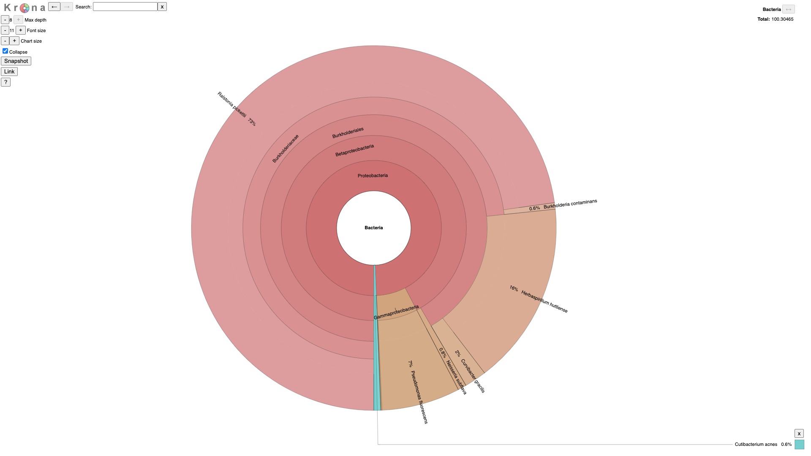

# Figure\_folder

Study selection

OSD-386 , OSD-37 , OSD-38 , OSD-321 , OSD-120 , OSD-193 , OSD-217 , OSD-218 , OSD-223 , OSD-281 , OSD-416 , OSD-522 , OSD-69 , OSD-375 , OSD-7 , OSD-16 , OSD-314

17 studies found in the OSDR

<figure><figcaption></figcaption></figure>

<figure><figcaption></figcaption></figure>

<figure><figcaption></figcaption></figure>

GLDS-37\_rna\_seq\_Atha\_Ler-0\_sl-pool\_GC\_Rep5\_R2-GC-C5\_R1/2\_trimmed.fastq

<figure><figcaption></figcaption></figure>


