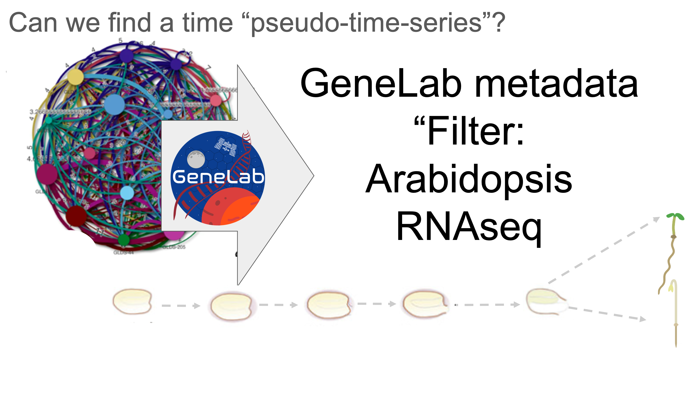

# Microbiome of seedling in space

**Microbiome of seedling in space** This repo contains data products produced while exploring the microbial communities present in a series of studies with similar meta-data characteristics

**Goal(s)** To identify evidence for microbes that are differentially abundant in orbit relative to ground controls.

**Keywords:** Spaceflight, Arabidopsis, Microbiome, RNAseq, meta-analysis, plant genetics

**Introductory/Summary:** Spaceflight presents a unique environment for biological experiments, notably due to the presence of microgravity and other space-specific factors. Abidopsis, a widely used model organism in plant biology, has been the focus of numerous studies to explore plant growth and development in space. Here we describe the selection of 5 Open Science Data Resportory (OSDR) datasets, as they provided a comprehensive overview of various Arabidopsis seedling development experiments conducted during spaceflight. Understanding how plants respond to these conditions is crucial for long-term space missions and offers insights into fundamental biological processes, studies collectively comprise 38 observations across 8 primary variables. While their transcriptomes have been extensively researched (see reference on OSDR accession home pages linked below) to date no work has been done to assess if these samples can also provide insight into the microbial response to spaceflight. Overall, these accessions from the GeneLab data repository provide invaluable data for understanding the complex dynamics of Arabidopsis thaliana development and potential interactions with its microbial community development under varied environmental conditions, but particularly focusing on the effects of microgravity.

***

<figure><figcaption>
<strong>Figure:</strong> Filtering using GeneLab metadata identifies similar studies (as described by Barker et al., 2023)
</figcaption></figure>

***

**Separate analysis:** Combining analysis of OSD-37, OSD-38, OSD-120, OSD-231 and OSD-321 will provide new insights.

Each of the studies' transcriptome can be analysed separately

https://visualization.genelab.nasa.gov/data/OSD-37

https://visualization.genelab.nasa.gov/data/OSD-38

https://visualization.genelab.nasa.gov/data/OSD-120

https://visualization.genelab.nasa.gov/data/OSD-218

https://visualization.genelab.nasa.gov/data/OSD-321

**Separate analysis plan:** Pull raw Fastq files from OSD-37 for WT Col-0 variety, filter reads that align to the Arabidopsis Genome and quantify the transcripts that remain below to the microbial community. Compare flight vs ground abundance. Repeat for OSD-38, OSD-120, OSD-218, OSD-321.

**Combined analysis:** Merge abundance measurements and calculate statistics

**Recommended new method for metatranscriptome analysis**

<figure><figcaption>
https://github.com/nf-core/metatdenovo/tree/dev
</figcaption></figure>

**Objectives of this essay/paper plan:**

## Quantifying Microbiome-Related Transcripts in Plant RNAseq Data from Space-Based Experiments

The exploration of plant-microbe interactions under the unique conditions of spaceflight represents a critical avenue of research. The adaptation of these relationships in microgravity environments is fundamental to the conception and development of resilient, sustainable agricultural systems beyond Earth. Our study focuses on the methodological approaches for quantifying microbiome-associated transcripts within plant RNAseq datasets derived from experiments conducted in space.

### Introduction

Spaceflight presents an unparalleled environment for examining the dynamics between plants and their symbiotic microbiomes. The microgravity conditions offer a unique setting to observe potential modifications in plant-microbe interactions, which could play a pivotal role in sustaining long-term extraterrestrial colonization efforts through advanced agricultural practices.

### Objectives

1. To delineate the methodology for extracting and quantifying microbiome-related transcripts from plant RNA sequencing data obtained in microgravity conditions.
2. To understand how these interactions between plants and their microbiomes are altered in spaceflight, potentially contributing to the development of robust food production systems for future space missions.

### Methodology

This research will employ state-of-the-art bioinformatic techniques to analyze RNA sequencing (RNAseq) data from plant samples grown in space. The process involves:

* **Sample Preparation**: Isolation of total RNA from plant tissues, ensuring the preservation of microbial RNA.
* **Sequencing**: Utilization of high-throughput sequencing technologies to capture a broad spectrum of plant and microbial transcripts.
* **Data Analysis**: Implementation of computational tools to differentiate plant-derived RNA from microbiome-associated RNA transcripts. This step includes the mapping of RNAseq reads to known databases of plant and microbial genomes to quantify the abundance of specific transcripts related to the microbiome.

### Expected Outcomes

The expected outcomes of this study include a comprehensive understanding of:

* The changes in gene expression profiles of plants and their associated microbiomes under the influence of microgravity.
* The identification of critical microbiome-related genes that could facilitate the development of sustainable agricultural practices in space.
* The establishment of a standardized methodology for analyzing plant-microbiome interactions in extraterrestrial environments.

#### Identifying Key Pathways in Plant-Microbe Interactions Through Meta-transcriptome Analysis

The primary objective of our investigation is to delineate the molecular pathways governing plant-microbe interactions within a space environment. By generating and analyzing a comprehensive meta-transcriptome through RNA sequencing (RNAseq), we aim to elucidate the differential expression patterns of genes that facilitate communication between plants and their associated microbial communities. Understanding these patterns is pivotal to enhancing plant vitality and growth under the unique conditions encountered in extraterrestrial habitats.

#### Microbiome Adaptation in Space: An RNAseq Approach

A secondary, but equally important, aspect of our research focuses on characterizing the shifts within the microbiome of Arabidopsis plants subjected to spaceflight conditions compared to those grown under terrestrial controls. By scrutinizing the RNAseq data, we intend to identify microbial transcripts that are uniquely present or significantly altered in space-grown plants. These insights will shed light on the adaptive strategies employed by the microbiome in a microgravity environment, contributing to our understanding of microbial ecology in space.

#### Advancing Space-Based Agriculture

This investigation is poised to make significant contributions to the field of space-based agricultural sciences. By comprehensively understanding plant-microbe interactions and the microbiome's adaptability to space conditions, we can lay the groundwork for developing robust food production systems for long-duration space exploration missions. Our targeted approach in analyzing RNAseq data from Arabidopsis plants grown under flight and ground conditions, without the confounding effects of varying gravity or radiation, ensures the relevance and applicability of our findings to space agriculture.

**If you want to get started these lines of code might help**

**Thanks for your help**
