# MATRIX5: Pseudo-time-series seedling establishment in microgravity with and without light 

**MATRIX-V5 Plant AWG meta-analysis**
This repo contains data products produced while exploring a series of studies with similar meta-data characteristics
Arabidopsis as the species, Flight vs Ground as the Treatment, RNAseq as the assay type, no fraction G forces or additional radiation treatments.

**Goal.** To identify loci involved in the adaptation to space flight with and without light-induced photomorphogenesis.  

**Keywords:** Spaceflight, Arabidopsis, RNAseq, meta-analysis, plant genetics, hypoxia, Reactive Oxygen Species(ROS), nitric oxide (NO), The N-end rule pathway of ubiquitin-mediated targeted proteolysis, N-degron pathways, protein degradation, proteostasis, oxygen, termination, seedling, time-series.

**Introductory/Summary:** Overall, these accessions from the GeneLab data repository provide invaluable data for understanding the complex dynamics of Arabidopsis thaliana development under varied environmental conditions, particularly focusing on the effects of microgravity and light on different genotypes, ages, and tissues. Spaceflight presents a unique environment for biological experiments, notably due to the presence of microgravity and other space-specific factors. Understanding how plants respond to these conditions is crucial for long-term space missions and offers insights into fundamental biological processes. Arabidopsis, a widely used model organism in plant biology, has been the focus of numerous studies to explore plant growth and development in space. The selection of these 5 GLDS datasets, comprising 38 observations across 8 variables, provides a comprehensive overview of various Arabidopsis seedling development experiments conducted during spaceflight.

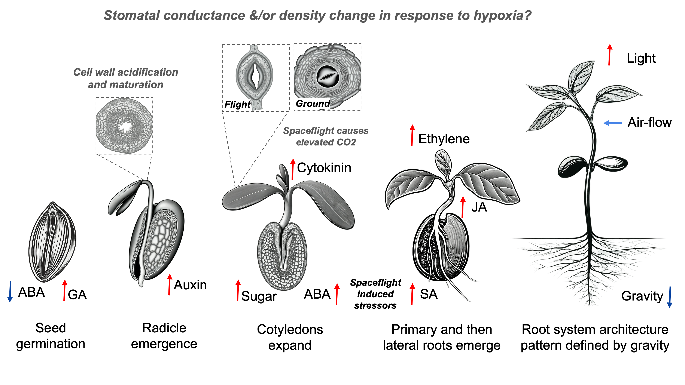
**Figure 1:** Seedling establishment might be affected due to changes in hormonal signalling due to changes in gaseous exchange as well as due to the lack of a gravity vector. 

---

**Importance of seed germination for seedling establishment and its influence on the life cycle**

Seed germination is a crucial stage in the life cycle of plants, marking the transition from a dormant seed to an actively growing seedling. This process is essential for seedling establishment and subsequent plant growth, as it determines the vigour and overall health of the plant. The importance of seed germination extends beyond the initial stages of plant development, as it also influences the plant's reproductive success and ability to adapt to changing environmental conditions. In this essay, we will explore the significance of seed germination for seedling establishment and its impact on the life cycle of plants. We will examine the role of germination in determining seedling vigour and subsequent plant growth, as well as its influence on the overall reproductive success and adaptation strategies of plants.

**Microgravity and its effects on seedling establishment** 

Microgravity, also known as weightlessness, is a unique environment characterized by the absence of gravity or a gravitational field that is significantly weaker than that of Earth. This condition can be achieved through various means, such as spaceflight, parabolic flights, or drop towers. Plants exposed to microgravity experience a range of physiological and developmental changes compared to their counterparts grown in normal gravity conditions. This introductory paragraph provides an overview of microgravity, its effects on plant growth and development, and specific effects on seed germination, including the influence of elevated carbon dioxide (CO2) during the germination process.

**Objectives of this essay/paper plan**

The exploration of space presents unique challenges and opportunities for plant growth and agriculture. Understanding the fundamental processes of seed germination and their regulation in microgravity environments is crucial for the success of future space missions and the establishment of sustainable food production systems beyond Earth. This essay aims to examine the stages of seed germination and their hormonal regulation, compare seed germination in microgravity and ground controls, investigate the effects of light on seed germination in microgravity, and discuss the implications of these findings for space agriculture and future research. By gaining insights into the physiological and molecular mechanisms underlying seed germination in microgravity, we can develop strategies to optimize plant growth and crop production in space, ensuring the long-term sustainability of human space exploration and the potential for off-world agriculture

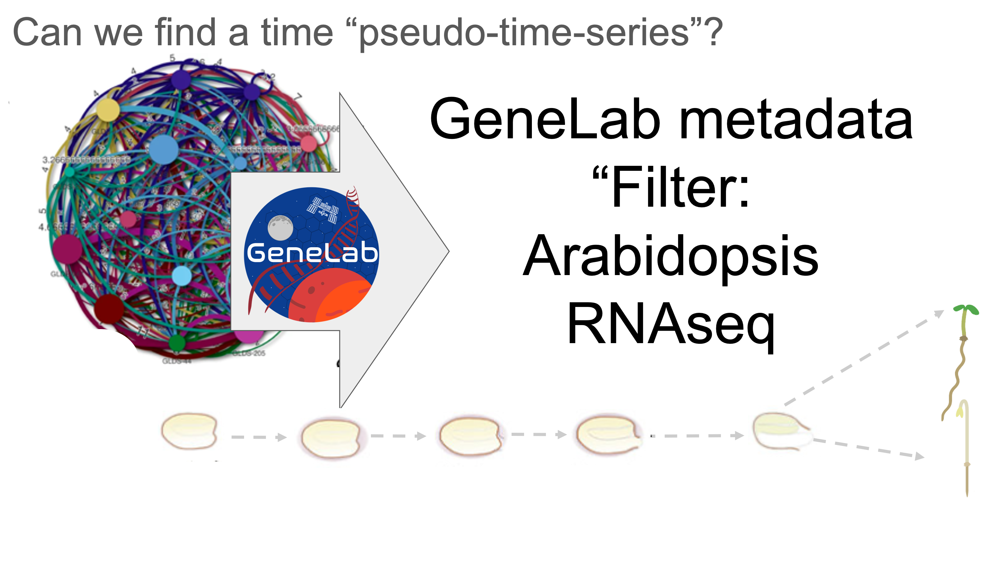
**Figure 2:** Filtering using GeneLabv metadata identifies similar studies (as described by Barker et al., 2023).

---

**Separate analysis:** Combining anlysis of OSD-37 , OSD-38 , OSD-120, OSD-231 and OSD-321 will provide new insights. 

Each of the studies can be analysed separately 

https://visualization.genelab.nasa.gov/data/OSD-37

https://visualization.genelab.nasa.gov/data/OSD-38

https://visualization.genelab.nasa.gov/data/OSD-120

https://visualization.genelab.nasa.gov/data/OSD-231

https://visualization.genelab.nasa.gov/data/OSD-321

**Combined analysis:** 

This can be done using the new NASA GeneLab multi-study visualisation tools: https://visualization.genelab.nasa.gov/data/

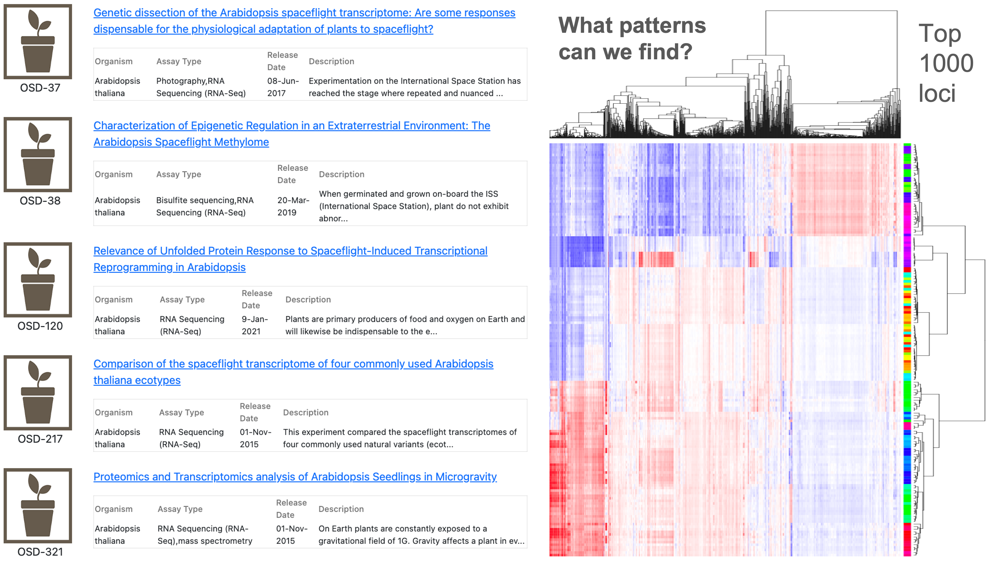
--
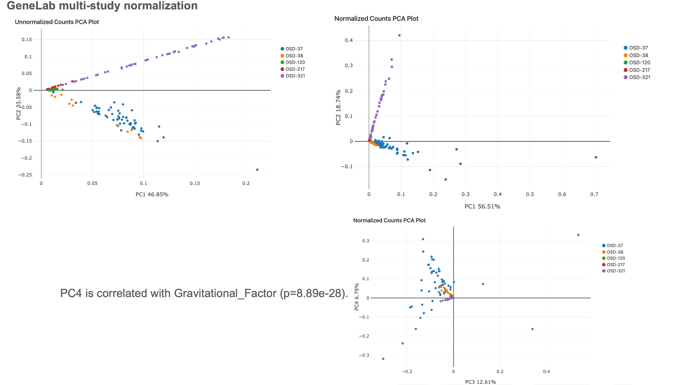
--
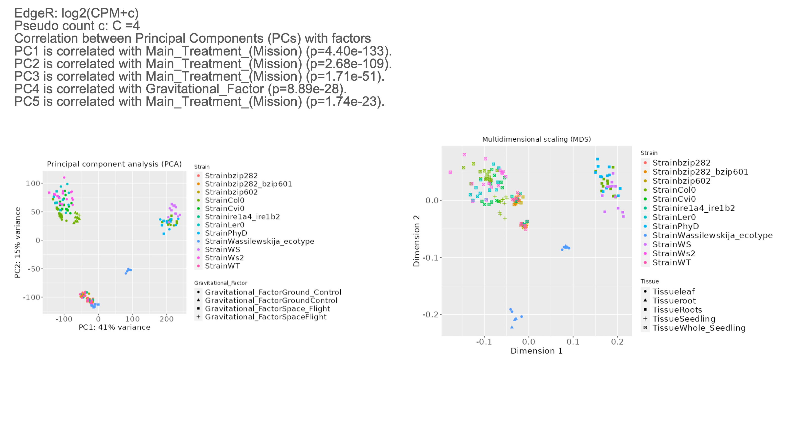
--
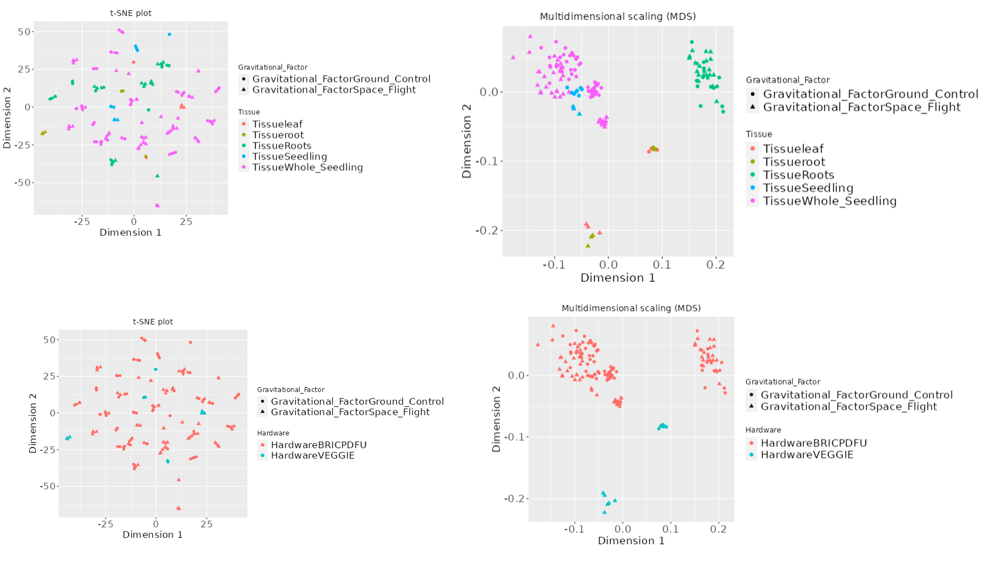

**Figure 3:** PCA, MDS and t-sne plots showing combined samples. Color grouping is by OSD-#, Strain and gravitational factor respectively. 

---

**Similarities and differences in methods GeneLab Metadata mining reveals similarities between these studies** 
GeneLab Data System (GLDS) Identifiers enable tracking of specific datasets within a larger repository. These identifiers, such as GLDS-37, GLDS-38, GLDS-120, GLDS-218, GLDS-321,  etc., are crucial for cross-referencing and detailed analysis of the spaceflight experiments involving Arabidopsis thaliana. By cataloging experiments in this manner, the GeneLab researchers enabled efficient access allowing comparison of different studies and enhancing our understanding of plant responses to spaceflight conditions.

**A. Key Similarities between studies:** These studies were selected as they have several key methodologies and conditions that are conserved that is the use of agar nutrient gels in petri dishes to be used as the primary source of moisture and nutrients. The use of BRIC hardware has allowed the assessment of a range of ecotypes and genotypes on Phytagel plates in Petri dish fixation units (PDFU). The BRIC hardware has been used as its specialized PDFU growth chambers provide a controlled dark environment for plant growth in orbit. There is a notable uniformity in the short-duration nature of these studies, with plants being harvested in their nascent stages, providing insights into early growth dynamics. The addition of light in GLDS-120, allows comparison of plants that undergo photomorphogenesis in perpetual light to those that undergo skotomorphogensis in complete darkness, which is another pivotal aspect as this enables oxygen production via photosynthesis. The selection of this variation is not arbitrary but deliberate, aimed at unravelling the intricate effects of light on plant growth, development and morphogenesis. The choice of ecotypes/genotypes in these studies is not diverse but rather concentrated on specific, well-characterized strains such as Col-0, WS-0, and mutant variations of Col. This choice indicates a preference for using genetically familiar and extensively studied plant lines, facilitating comparative analysis and consistency in results. Lastly, there's a discernible emphasis on studying specific plant tissues, primarily roots, shoots and etiolated seedlings. This focus is indicative of a keen interest in understanding how different environmental stimuli influence the early stages of root and seedling development, crucial for comprehending the broader aspects of plant growth and adaptability.

**B. Key differences:** The differences between the GLDS studies are quite pronounced, especially when considering the hardware used and the lighting conditions, both of which significantly impact the type of tissue studied. In GLDS-38, GLDS-37, and GLDS-321, the use of BRIC hardware has been a defining feature. This specific type of hardware likely influences the nature of the experiments and the results obtained, particularly in terms of how the plant tissues respond to different environmental conditions. On the other hand, GLDS-120 uses Phytagel plates, and GLDS-218 is conducted with the Vegetable Production System, suggesting variations in how the plants are grown and observed. These differences in hardware may directly influence the types of tissues that can be effectively studied and the conditions under which these tissues develop. In terms of lighting conditions, each study has a unique approach that shapes the nature of the tissue studied. GLDS-38 is unique for its experiments conducted in complete darkness, while GLDS-120 features a variety of lighting conditions including continuous light and a combination of light activation followed by dark growth. GLDS-218's use of continuous purple light is particularly noteworthy, as it represents a specific wavelength that can have unique effects on plant growth and development. GLDS-37 and GLDS-321, meanwhile, incorporate studies in both complete darkness and periods of light activation followed by dark growth. These varied lighting conditions are crucial as they directly affect the physiological and developmental processes in plants, influencing the type of tissue that can be effectively studied in each experiment. The age at harvest and the specific ecotype and genotype being studied are also key differentiators among these studies. GLDS-120 investigates several ecotypes/genotypes including Col-0, WS-0, and Col-0 PhyD, offering a broad perspective on how different genetic backgrounds respond to the experimental conditions. GLDS-37 goes even further by focusing on a wider range of ecotypes/genotypes, such as Ws-2, Ler-0, Cvi-0, and Col-0. This diversity in genetic material is crucial for understanding the range of responses in plant biology. GLDS-321 studies variations of Col, including Col, Col bzip20, and Col bzip 60, allowing for a more nuanced understanding of how slight genetic variations can impact plant responses. Conversely, GLDS-38 and GLDS-218 limit their studies to the Col-0 and WS-0 ecotypes/genotypes, respectively, offering a more focused but potentially less diverse set of data. The age at harvest presents another layer of complexity and interesting research opportunity related to confronting a pseudo time series. GLDS-38 and GLDS-321 are notable for their extremes in harvest ages – as short as 3 days and as long as 14 days, respectively. This contrasts with GLDS-120, GLDS-218, and GLDS-37, which all have similar ages at harvest, around 8-12 days. The age at harvest is crucial, as it determines the developmental stage of the plant tissues being studied. Younger tissues may respond differently to environmental conditions than more mature tissues. This aspect, coupled with the specific ecotypes/genotypes under investigation, provides insights to the natural variation in the plant's developmental response to spaceflight. 

---

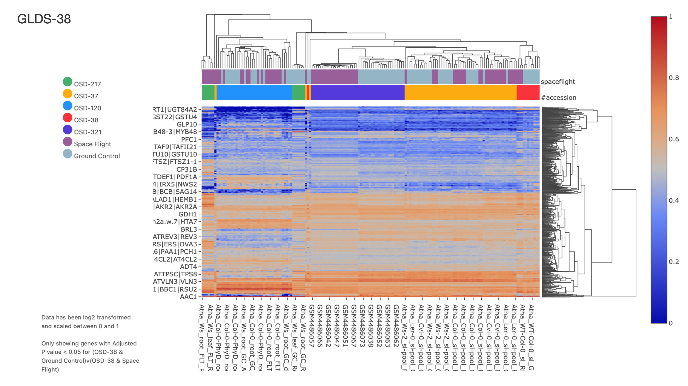
---
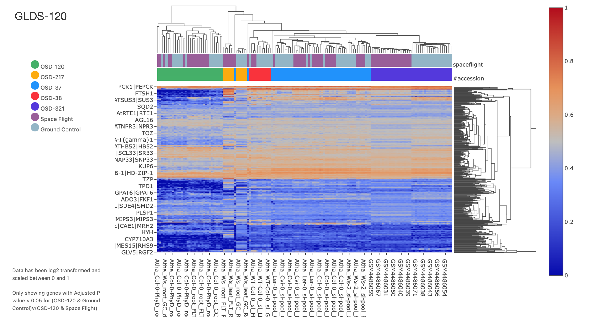
---
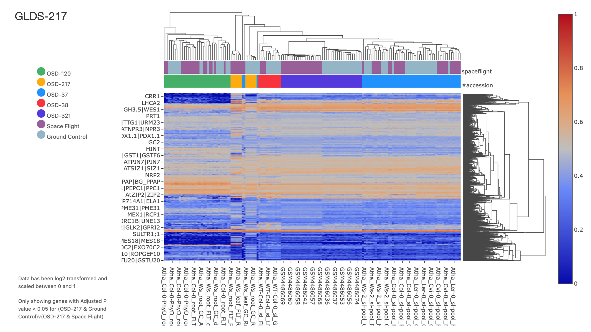
---
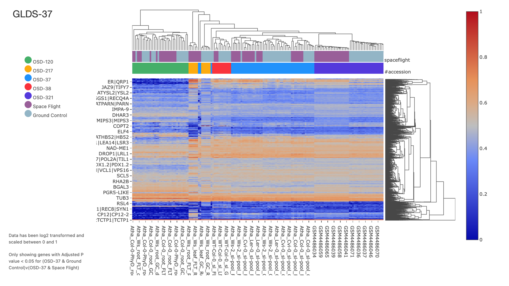
---
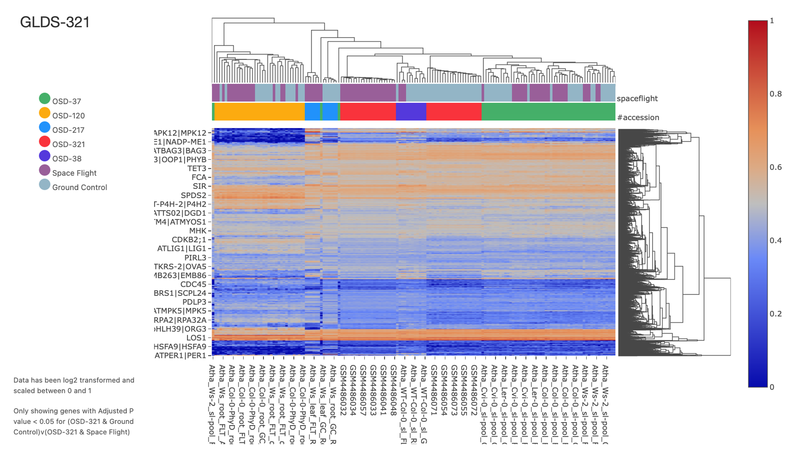

**Figure 4:** A series of heat maps showing the top most significantly differentially expression loci's expression across all studies but selected by on DESeq models calculated for each OSD-# accession. 

---

**PCA ontology analysis can identify biological processes and KEGG pathways involved in seedlings' establishment during spaceflight.** 

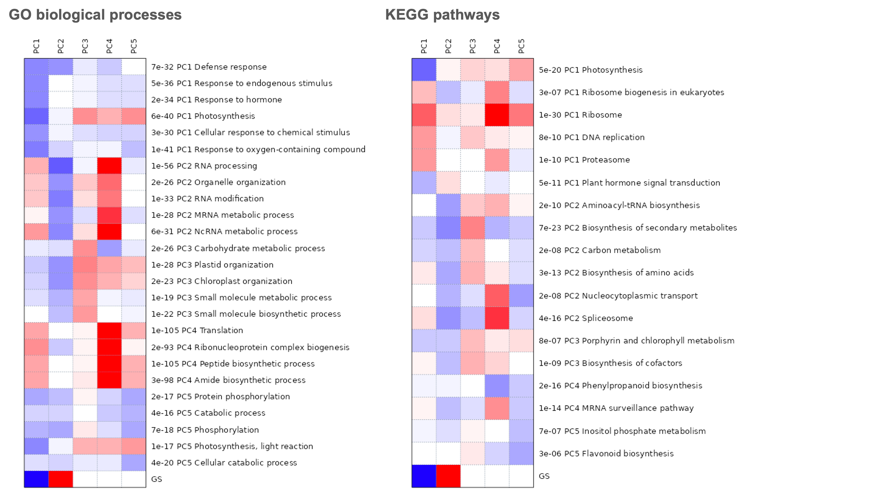
**Figure 5:** Ontology enrichment analysis on loci associated with the first 5 eigenvalue trajectories of the PCA analysis. 

---

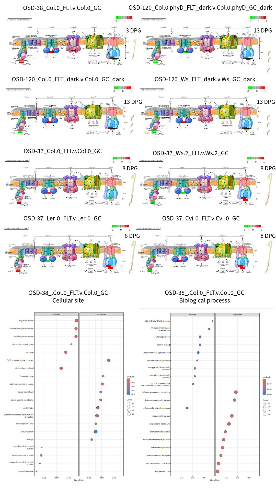
**Figure 6:** Wildtype Space flight verse Ground control data projected onto KEGG oxidative phosphorylation. 

---

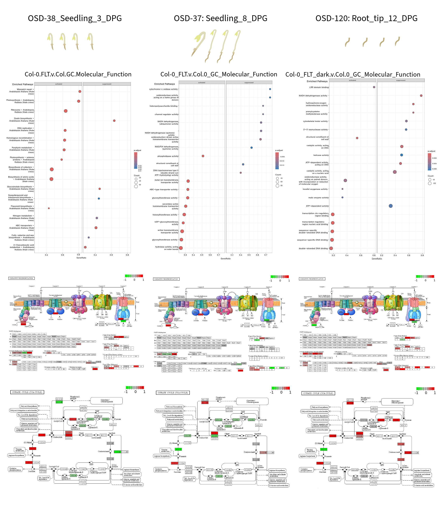
**Figure 7:** Natural variation in Space flight verse Ground control data projected onto Molecular function. 

---

**Seed germination and seedling development involve a series of environmentally regulated genetic circuits.** 

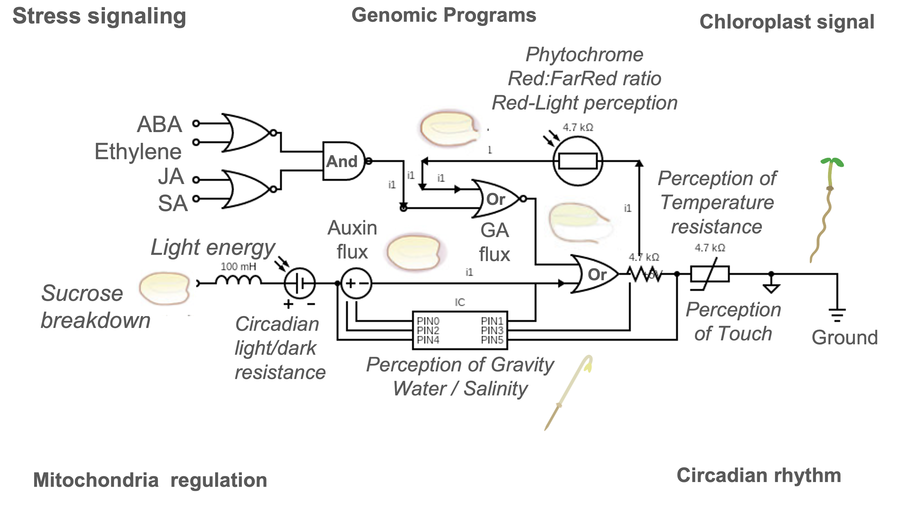
**Figure 8:** Diagram using circuit analogies to explain environmental regulation of plant hormonal pathways involved in seedlings establishment. 

---

# Future work:

**These heat maps show some of the differentially expressed loci that will be discussed at future NASA GeneLab Plant Analysis Working Group meetings.** 

Looking for collaborators for this like...
1. Description and discussion of results. 
2. Reactome pathway visualisation
3. Single-cell enrichment analysis
4. Machine learning 
5. DREM transcription factor analysis
6. Alternative splicing analysis
7. Literature mining and reference organisation for publication
8. Graphics design for figure development 
9. Addition of other omics
   a. Proteomics
   b. Methyl-seq
   c. Background microbiome quantification
   D. smallRNA

To perform extra analysis in R we had to merge the normalised count's matrix. 
**2bc...**  

**Example code used for multi-study meta-analysis** 

R code
``

#Load libraries
library(tidyverse)
library(data.table)

#Set working directory
setwd("New_Plant_Matrix")

URLs<-c("https://genelab-data.ndc.nasa.gov/genelab/static/media/dataset/GLDS-120_rna_seq_Normalized_Counts.csv?version17",

        "https://genelab-data.ndc.nasa.gov/genelab/static/media/dataset/GLDS-38_rna_seq_Normalized_Counts.csv?version12",
        
        "https://genelab-data.ndc.nasa.gov/genelab/static/media/dataset/GLDS-37_rna_seq_Normalized_Counts.csv?version11",
        
        "https://genelab-data.ndc.nasa.gov/genelab/static/media/dataset/GLDS-321_rna_seq_Normalized_Counts.csv?version4",
        
        "https://genelab-data.ndc.nasa.gov/genelab/static/media/dataset/GLDS-218_rna_seq_Normalized_Counts.csv?version10")
        
destFiles<-c("https://genelab-data.ndc.nasa.gov/genelab/static/media/dataset/GLDS-120_rna_seq_Normalized_Counts.csv?version17",
        
        "https://genelab-data.ndc.nasa.gov/genelab/static/media/dataset/GLDS-38_rna_seq_Normalized_Counts.csv?version12",
                     
        "https://genelab-data.ndc.nasa.gov/genelab/static/media/dataset/GLDS-37_rna_seq_Normalized_Counts.csv?version11",
                     
        "https://genelab-data.ndc.nasa.gov/genelab/static/media/dataset/GLDS-321_rna_seq_Normalized_Counts.csv?version4",
                     
        "https://genelab-data.ndc.nasa.gov/genelab/static/media/dataset/GLDS-218_rna_seq_Normalized_Counts.csv?version10")
      

#Download files from URLs and save them to destination files

for (i in 1:length(URLs)){
  download.file(URLs[i], destFiles[i])
}

PlantMetaMatrix <- read_csv("destFiles")
``

**If you want to get started these lines of code might help**

**Thanks for your help**
