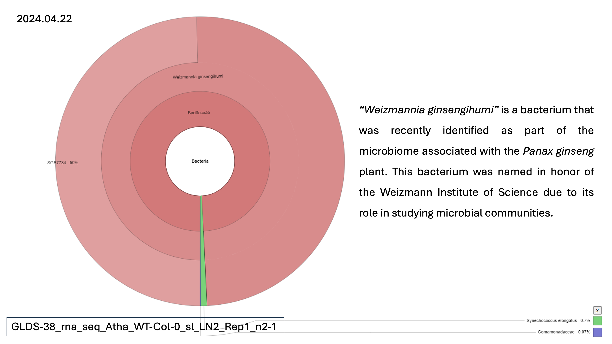

# Zerrin April 23rd OSD-38 preliminary update

**Key Discovery:**

Our analysis of plant microbiomes has identified the bacterium _Weizmannia ginsengihumi_ within the OSD-38 sample. This bacterium, previously unreported in plants other than _Panax ginseng_, represents a major development in microbial ecology and plant science.

**Key detail:**&#x20;

The sample analysed was ->  GLDS-38\_rna\_seq\_Atha\_WT-Col-0\_sl\_LN2\_Rep1\_n2-1 -> this sample was the liquid N2 fixation control performed at Ames research center (ARC). Dr Sarah Wyatt ca provide more details if necessary.&#x20;

<figure><figcaption></figcaption></figure>

<figure><figcaption></figcaption></figure>

**Potential Benefits:**

_Weizmannia ginsengihumi_ is known for its association with beneficial properties in _Panax ginseng_, including antioxidant, anti-inflammatory, and immune-boosting effects. Its metabolites might offer similar benefits to other plants, a potential area for further investigation.

<figure><figcaption></figcaption></figure>

**Further Exploration:**

We've included additional data (relative abundance plots) from our unpublished manuscript, detailing findings across various medicinal plants. Beyond culture-independent methods, we've also initiated a culture-dependent study using DNA analysis and BLAST to explore significant microorganisms for further investigation. Understanding this bacterium's survival strategies and metabolite production within the ISS microbiome could be valuable.&#x20;

Collaboration with researchers studying ISS microbiomes is so much fun! :-D&#x20;

