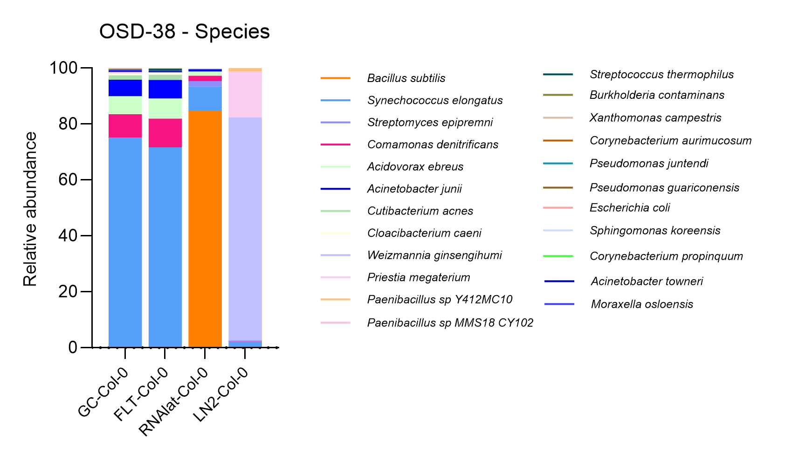

# Zerrin May 20th BRIC20

[Link to slides](https://docs.google.com/presentation/d/1LJJZ0xNDrtRYMG1zxd1q2OLNfYuAdJOsGNyKrYqsGBI/edit?usp=sharing)



Application of HAIIA (Hierarchical All-Against-All Association) on BRIC20. It employs Spearman correlation to analyze correlations between samples, helping identify those with similar microbial profiles.

After the relative abundance analysis, I plan to perform Alpha and Beta diversity analyses.&#x20;

If this format works for you, I can send all the relative abundance plots (phylum, class, order, genus, and species), along with the methodology and results for OSD-38, tomorrow. Please find an example of the relative abundance bar plot for OSD-38 attached.

<figure><figcaption></figcaption></figure>

HALLA similarity comparison&#x20;

<figure><figcaption></figcaption></figure>


